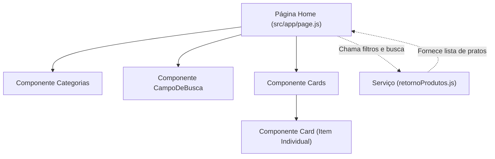

# 🍽️ Cardápio Digital - Restaurante

[](https://nextjs.org/)
[](https://react.dev/)
[](https://github.com/css-modules/css-modules)
[](https://vercel.com/)
[](LICENSE)

> Uma aplicação web moderna, dinâmica e totalmente responsiva de **Cardápio Digital para Restaurantes**, desenvolvida com **Next.js (App Router)** e **React**. Projetada para proporcionar uma experiência fluida e intuitiva tanto em smartphones (ideal para leitura via QR Code nas mesas) quanto em tablets e desktops.

---

## 🔗 Demonstração Online

- 🌐 **Deploy na Vercel:** [cardapio-restaurante-chi.vercel.app](https://cardapio-restaurante-chi.vercel.app/)

---

## 📌 Sumário

- [Visão Geral](#-visão-geral)
- [Funcionalidades Principais](#-funcionalidades-principais)
- [Tecnologias Utilizadas](#-tecnologias-utilizadas)
- [Arquitetura e Estrutura de Pastas](#-arquitetura-e-estrutura-de-pastas)
- [Detalhamento dos Módulos e Componentes](#-detalhamento-dos-módulos-e-componentes)
  - [Camada de Serviços (`src/servicos/`)](#1-camada-de-serviços-srcservicos)
  - [Camada de Componentes (`src/components/`)](#2-camada-de-componentes-srccomponents)
  - [Página Principal (`src/app/page.js`)](#3-página-principal-srcapppagejs)
- [Categorias e Pratos Disponíveis](#-categorias-e-pratos-disponíveis)
- [Como Executar o Projeto Localmente](#-como-executar-o-projeto-localmente)
- [Como Fazer o Deploy](#-como-fazer-o-deploy)
- [Boas Práticas e Diferenciais Técnicos](#-boas-práticas-e-diferenciais-técnicos)
- [Licença e Autor](#-licença-e-autor)

---

## 📖 Visão Geral

O **Cardápio Digital** foi concebido para modernizar a apresentação de pratos e bebidas em estabelecimentos gastronômicos. Através de uma interface elegante e limpa, os clientes podem:

1. Navegar facilmente entre diferentes categorias de refeições com filtros de um clique.
2. Realizar pesquisas dinâmicas por texto, encontrando itens por nome, categoria ou até iniciais.
3. Visualizar fotos de alta qualidade, descrições detalhadas e preços devidamente formatados na moeda brasileira (R$).

---

## ✨ Funcionalidades Principais

- 🏷️ **Filtro Rápido por Categorias:** Navegue entre *Entradas, Massas, Carnes, Bebidas, Saladas e Sobremesas* com indicação visual da categoria selecionada.
- 🔍 **Busca Inteligente e Tolerante:** 
  - Acionada automaticamente a partir de 3 caracteres digitados.
  - Normalização de strings (ignora acentos ortográficos, letras maiúsculas/minúsculas e espaços extras).
  - Suporte à busca por correspondência de nome, categoria e iniciais das palavras.
- 💰 **Formatação Monetária Dinâmica:** Exibição dos valores no padrão monetário brasileiro (`R$ 00,00`) através da API nativa `Intl / toLocaleString("pt-BR")`.
- 📱 **Totalmente Responsivo (Mobile First):** Layout adaptável para smartphones, tablets e monitores widescreen.
- ⚡ **Alta Performance e SEO:** Construído com o motor do Next.js e carregamento otimizado de imagens e fontes.

---

## 🛠️ Tecnologias Utilizadas

| Tecnologia | Finalidade |
| :--- | :--- |
| **[Next.js](https://nextjs.org/) (v16+)** | Framework React para produção com App Router |
| **[React](https://react.dev/) (v19+)** | Biblioteca para construção de interfaces declarativas baseadas em componentes |
| **[CSS Modules](https://github.com/css-modules/css-modules)** | Estilização modularizada e escopada por componente |
| **[Google Fonts (Poppins)](https://fonts.google.com/specimen/Poppins)** | Tipografia moderna e legível |
| **[Vercel](https://vercel.com)** | Plataforma de hospedagem e Continuous Deployment (CI/CD) |

---

## 📂 Arquitetura e Estrutura de Pastas

O projeto adota o padrão de **Separação de Responsabilidades (SoC)**, mantendo regras de negócio e dados isolados da camada de apresentação:

```text
Cardapio-Restaurante/
├── public/                      # Recursos estáticos (imagens dos pratos, banners e ícones)
│   ├── banner.png
│   ├── lupa.png
│   ├── entrada.png, massa.png, carne.png...
│   └── [fotos dos pratos].jpg/.png
├── src/
│   ├── app/                     # Next.js App Router
│   │   ├── globals.css          # Reset CSS e definições globais de fonte/cores
│   │   ├── layout.js            # Layout raiz da aplicação e metadados SEO
│   │   ├── page.js              # Página principal (Controller/View)
│   │   └── page.module.css      # Estilos da página principal e cabeçalho
│   ├── components/              # Componentes visuais reutilizáveis
│   │   ├── CampoDeBusca/        # Barra de pesquisa com ícone e controle de input
│   │   │   ├── CampoDeBusca.module.css
│   │   │   └── index.jsx
│   │   ├── Cards/               # Container e listagem de pratos
│   │   │   ├── Card/            # Componente individual de exibição do prato
│   │   │   │   ├── Card.module.css
│   │   │   │   └── index.jsx
│   │   │   ├── Cards.module.css
│   │   │   └── index.jsx
│   │   └── Categorias/          # Barra de botões das categorias de pratos
│   │       ├── Categorias.module.css
│   │       └── index.jsx
│   └── servicos/                # Camada de Regras de Negócio e Dados
│       └── retornoProdutos.js   # Catálogo de produtos e funções de busca e filtro
├── docs/                        # Especificações técnicas e documentações auxiliares
├── jsconfig.json                # Configuração de paths aliases (@/*)
├── next.config.mjs              # Configurações do Next.js
├── package.json                 # Dependências e scripts do projeto
└── README.md                    # Documentação principal do projeto
```

---

## 🧩 Detalhamento dos Módulos e Componentes



### 1. Camada de Serviços (`src/servicos/retornoProdutos.js`)
Centraliza o acervo estático de pratos e provê funções puras de manipulação de dados:
- `produtos`: Array com **30 itens cadastrados**, contendo `id`, `nome`, `categoria`, `descricao`, `preco` e `imagem`.
- `categorias`: Lista com identificador, rótulo e ícone de cada categoria.
- `filtrarProdutos(categoria)`: Filtra pratos correspondentes à categoria recebida por parâmetro.
- `buscarProduto(textoDigitado)`: Executa busca textual resiliente. Utiliza `normalizarTexto()` com decomposição `NFD` para remover acentos e caracteres especiais, verificando ocorrências no nome, na categoria e nas iniciais.

### 2. Camada de Componentes (`src/components/`)
- **`Categorias/`**: Renderiza os botões com ícone e texto de cada categoria. O botão da categoria atualmente selecionada recebe estilo ativo destacado.
- **`CampoDeBusca/`**: Input de pesquisa controlado que aciona a função de busca ao digitar.
- **`Cards/`**: Responsável por mapear o array de pratos recebido e renderizar cada item. Exibe mensagem amigável caso nenhum prato seja encontrado.
- **`Cards/Card/`**: Cartão visual de cada prato, exibindo foto, título, categoria, descrição e valor monetário formatado.

### 3. Página Principal (`src/app/page.js`)
Atua como orquestrador da aplicação, gerenciando os seguintes estados via React Hooks (`useState`):
- `categoriaAtiva`: Categoria selecionada no momento (iniciada como `"Entradas"`).
- `textoBusca`: Valor atual do campo de pesquisa.
- `pratosExibidos`: Lista de pratos visíveis na tela.

---

## 🍽️ Categorias e Pratos Disponíveis

O cardápio conta com **30 itens** distribuídos em 6 categorias gastronômicas:

| Categoria | Ícone | Exemplo de Pratos |
| :--- | :---: | :--- |
| **Entradas** | 🥖 | *Bruschetta, Carpaccio, Paella, Ebi Spicy, Aligot* |
| **Massas** | 🍝 | *Lasanha Tradicional, Espaguete Pomodoro, Ravioli, Nhoque, Capeletti* |
| **Carnes** | 🥩 | *Picanha Nobre, Bife Ancho, Tomahawk Steak, Filé Mignon, Prime Rib* |
| **Bebidas** | 🍷 | *Vinho Tinto, Cerveja Artesanal, Refrigerante, Suco Natural, Whiskey* |
| **Saladas** | 🥗 | *Salada Caprese, Salada Caesar, Salada Grega, Salada Niçoise, Salada Waldorf* |
| **Sobremesas** | 🍰 | *Pudim de Leite, Torta Holandesa, Tiramisù, Cheesecake, Banoffee* |

---

## 🚀 Como Executar o Projeto Localmente

### Pré-requisitos
- [Node.js](https://nodejs.org/) (versão 18.17 ou superior recomendada)
- Gerenciador de pacotes `npm`, `yarn` ou `pnpm`

### Passo a Passo

1. **Clone o repositório:**
   ```bash
   git clone https://github.com/seu-usuario/Cardapio-Restaurante.git
   ```

2. **Acesse a pasta do projeto:**
   ```bash
   cd Cardapio-Restaurante
   ```

3. **Instale as dependências:**
   ```bash
   npm install
   # ou
   yarn install
   ```

4. **Inicie o servidor de desenvolvimento:**
   ```bash
   npm run dev
   # ou
   yarn dev
   ```

5. **Abra no navegador:**
   Acesse [http://localhost:3000](http://localhost:3000) para ver o cardápio em execução.

---

## 📦 Scripts Disponíveis

| Comando | Descrição |
| :--- | :--- |
| `npm run dev` | Inicia o servidor de desenvolvimento com Hot Reloading na porta `3000` |
| `npm run build` | Compila e otimiza a aplicação para o ambiente de produção |
| `npm run start` | Inicia o servidor com a build de produção |

---

## ☁️ Como Fazer o Deploy

A aplicação está otimizada para deploy instantâneo na **[Vercel](https://vercel.com/)**:

1. Crie uma conta na Vercel e conecte seu GitHub.
2. Importe o repositório `Cardapio-Restaurante`.
3. Mantenha as configurações padrão (Framework Preset: **Next.js**).
4. Clique em **Deploy**.

---

## 🌟 Boas Práticas e Diferenciais Técnicos

- **Componentização Limpa:** Código desacoplado e de fácil manutenção.
- **CSS Modules:** Sem colisões globais de classes e estilização organizada por escopo.
- **Normalização de Busca:** Experiência de pesquisa sem fricção (ex: digitar "espaguete" ou "Espáguete" retorna o mesmo resultado).
- **Sem Dependências Pesadas:** Aplicação leve, rápida e com carregamento instantâneo.

---

## 📄 Licença

Este projeto está sob a licença [MIT](LICENSE).

---

<p align="center">
  Desenvolvido com ☕ e dedicação por <b>Paulo Silva</b>.
</p>
